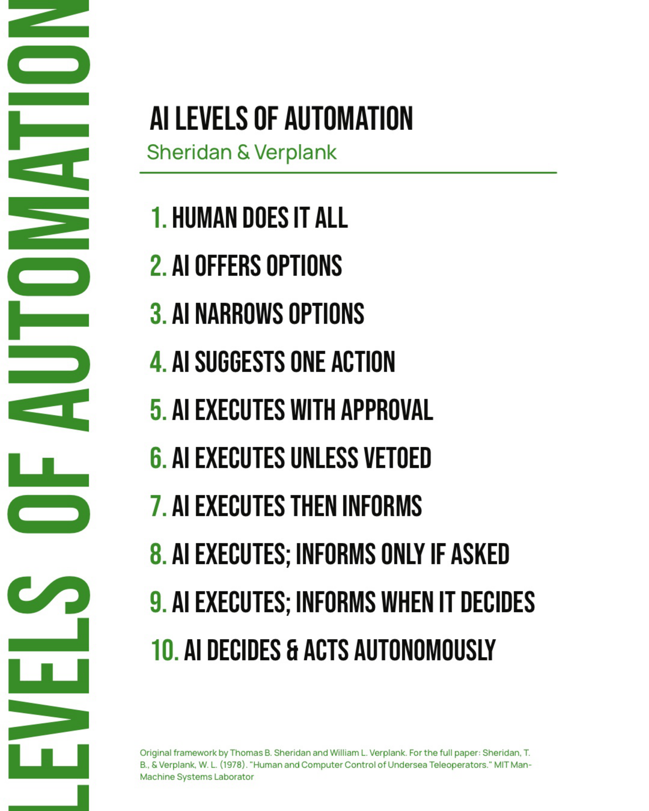
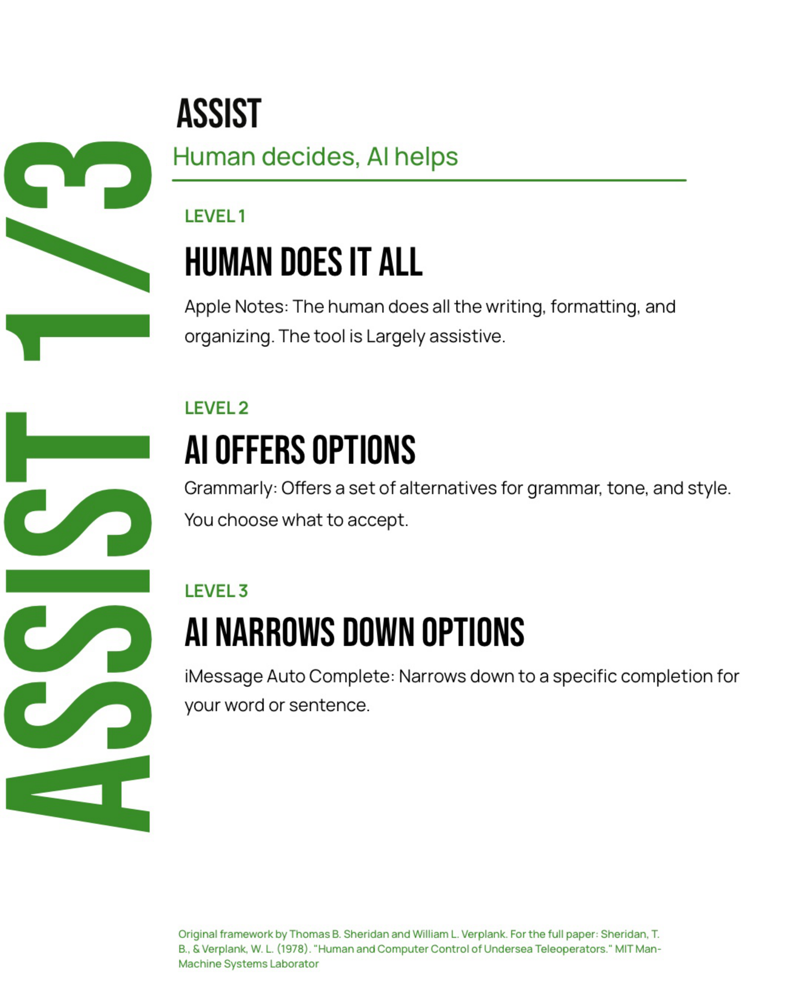
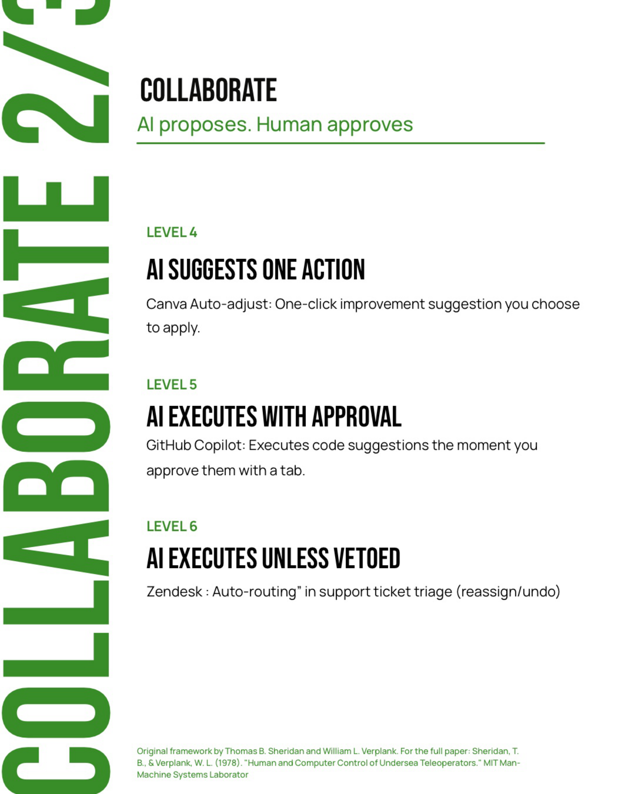
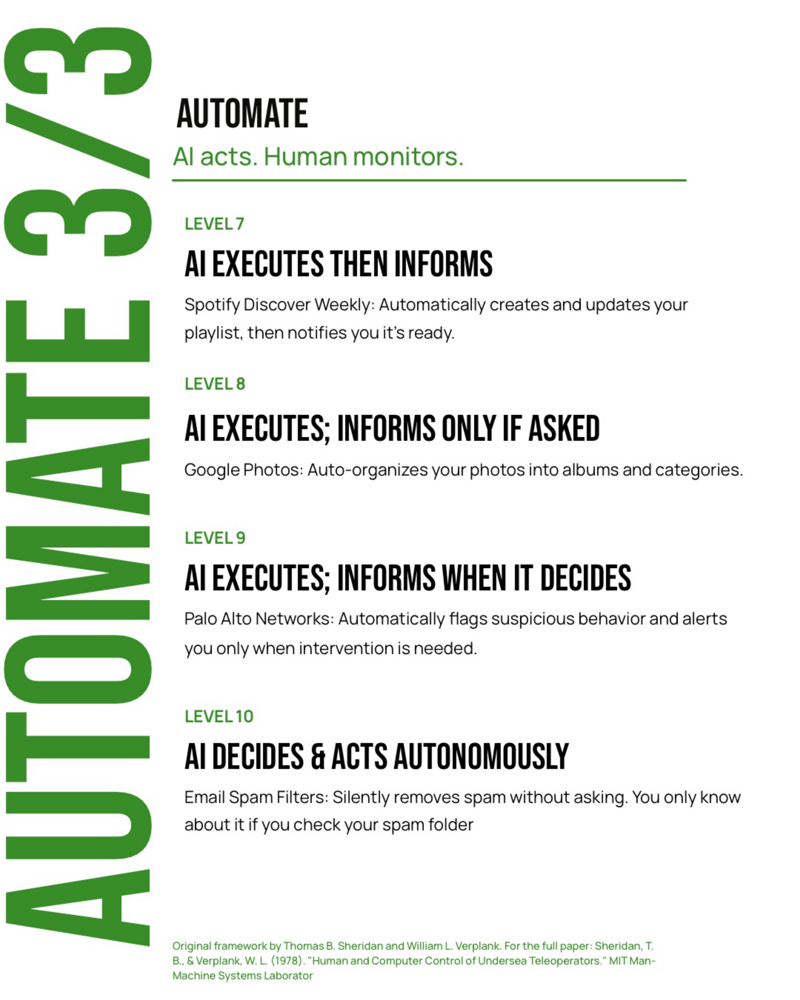
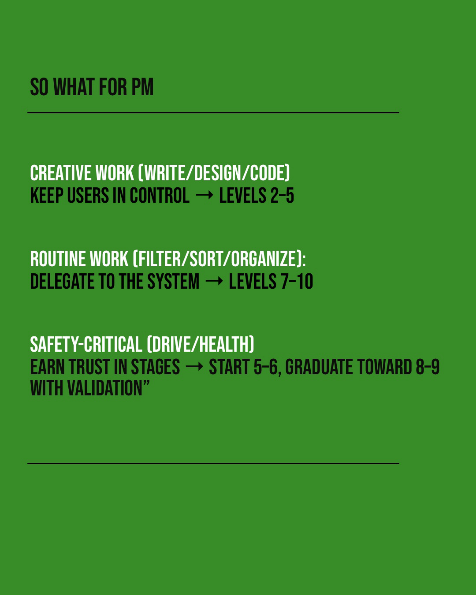

AI integration is rapidly becoming standard, sometimes even mandatory, in product roadmaps. From writing copilots to recommendation engines, products are shipping AI to help users make better decisions: find better homes, choose better contractors, pick better gifts.

Yet many AI features still underperform on the metrics that matter: activation, repeat usage, retention, and most importantly, trust.

The issue usually isn't the model. It's the product question being asked.

Instead of *"Where can we add AI?"*, a better question is: *"What level of autonomy should AI have in this workflow to help the user make progress on their job-to-be-done?"*

More automation does not equal a better product.

## The two ways AI features break trust

When autonomy doesn't match user expectations, users experience one of two failure modes:

- **Under-automated.** The AI asks for so much input and context that users wonder why they aren't just doing the task themselves. *"Why am I not just doing this myself?"*
- **Over-automated.** The AI takes control too early or too confidently, making users feel uncomfortable, confused, or distrustful. *"Wait... why did it do that?"*

The paradox: bad automation can be worse than no automation. The fix isn't more AI or less AI. It's choosing the right level of autonomy.

## A useful lens: the levels of automation

In 1978, Thomas Sheridan and William Verplank developed a framework that maps ten distinct levels of autonomy in human-computer interaction. It was written about undersea teleoperators, long before anyone was shipping copilots, and it maps onto AI products almost perfectly. The ten levels fall into three bands.

### Assist: human decides, AI helps

1. **Human does it all.** Apple Notes: the person does all the writing, formatting, and organizing. The tool is largely passive.
2. **AI offers options.** Grammarly: offers a set of alternatives for grammar, tone, and style. You choose what to accept.
3. **AI narrows down options.** iMessage autocomplete: narrows down to a specific completion for your word or sentence.

### Collaborate: AI proposes, human approves

4. **AI suggests one action.** Canva auto-adjust: a one-click improvement you choose to apply.
5. **AI executes with approval.** GitHub Copilot: executes a code suggestion the moment you approve it with a tab.
6. **AI executes unless vetoed.** Zendesk auto-routing: tickets are triaged automatically, and an agent can reassign or undo.

### Automate: AI acts, human monitors

7. **AI executes, then informs.** Spotify Discover Weekly: builds and updates your playlist, then tells you it's ready.
8. **AI executes, informs only if asked.** Google Photos: auto-organizes your photos into albums and categories.
9. **AI executes, informs when it decides to.** Palo Alto Networks: flags suspicious behavior automatically and alerts you only when intervention is needed.
10. **AI decides and acts autonomously.** Email spam filters: silently remove spam without asking. You only know if you check your spam folder.

## So what for product managers

Match the autonomy level to the type of work and its risk:

- **Creative work** (writing, design, code): keep users in control. Levels 2–5.
- **Routine work** (filtering, sorting, organizing): delegate to the system. Levels 7–10.
- **Safety-critical work** (driving, health): earn trust in stages. Start at levels 5–6 and graduate toward 8–9 as the system is validated.

The question to bring to every AI feature review isn't "Can the model do this?" It's "How much should it do on its own, and has the user had a chance to trust it yet?"

---

*Framework: Sheridan, T. B., & Verplank, W. L. (1978). "Human and Computer Control of Undersea Teleoperators." MIT Man-Machine Systems Laboratory.*
